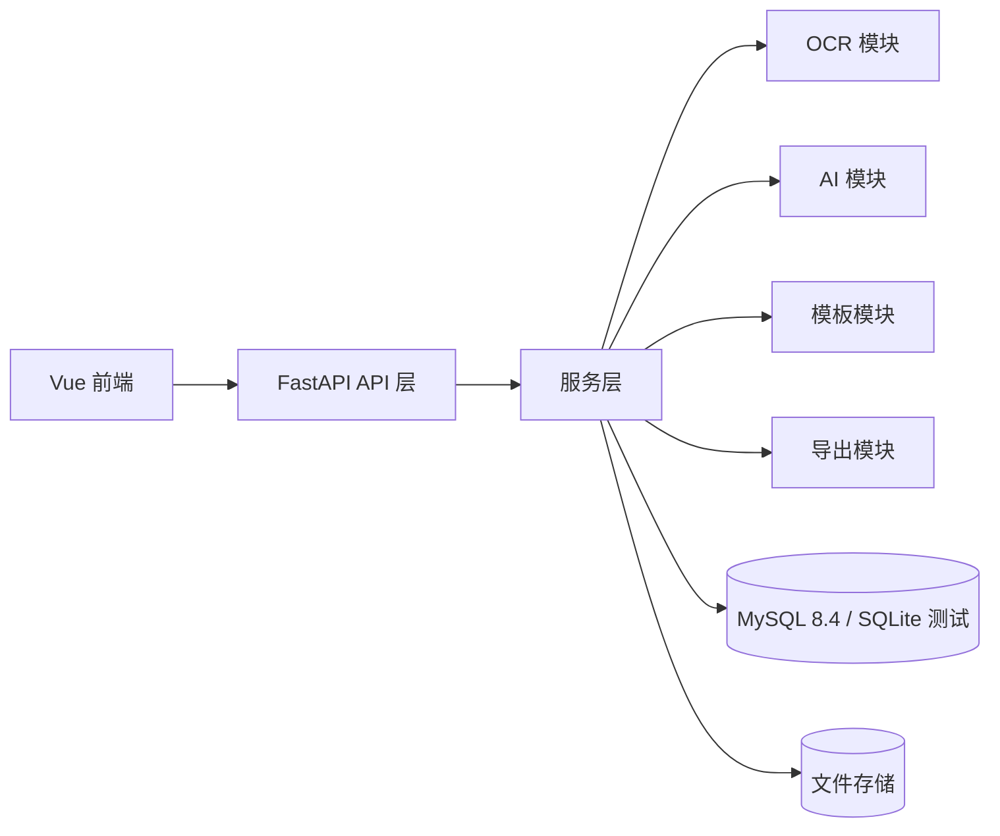

# 架构说明

## 总体结构

ReportFlow AI 采用单仓库、模块化单体后端与 Vue 前端组合。当前阶段不拆微服务，所有模块通过统一 Schema 和服务接口协作。

## 统一数据流

1. 前端上传文件或提交报表信息。
2. API 层完成参数校验、权限预留和统一响应包装。
3. 服务层围绕 `TaskItem`、`ReportContent`、`TemplateParseResult` 等公共 Schema 处理数据。
4. 持久化层使用 SQLAlchemy 2，正式环境连接 MySQL，自动化测试默认使用 SQLite 内存库。
5. Mock 服务返回可联调的结构化结果。

## 模块边界

- OCR 模块：只负责文件识别结果，不直接修改报表对象。
- AI 模块：只消费提取输入和任务列表，不直接读取模板实现。
- 报表模块：负责报表生命周期、版本和状态流转。
- 导出模块：只消费 `ReportContent`，输出文件结果。
- 模板模块：只负责模板解析和字段配置，不依赖报表生成细节。

## 数据库边界

数据库迁移不会影响前端 API 路径，也不会改变 `ReportContent` 和 `TaskItem` 的字段含义。跨数据库兼容字段使用 SQLAlchemy 通用类型，JSON 字段使用 `JSON`。
