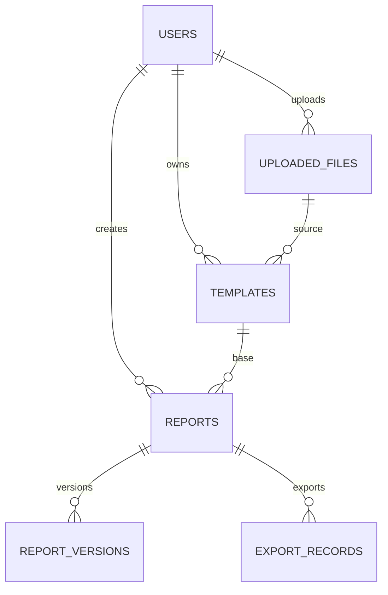

# 数据库设计

## 数据库技术栈

- 正式数据库：MySQL 8.4
- Python 驱动：PyMySQL
- ORM：SQLAlchemy 2
- 迁移工具：Alembic
- 测试数据库：SQLite 内存数据库
- 字符集：`utf8mb4`
- 排序规则：`utf8mb4_unicode_ci`

## 数据表

- `users`
- `uploaded_files`
- `templates`
- `reports`
- `report_versions`
- `export_records`

## 关系

- `users` 1:N `uploaded_files`
- `users` 1:N `templates`
- `users` 1:N `reports`
- `uploaded_files` 1:N `templates`
- `templates` 1:N `reports`
- `reports` 1:N `report_versions`
- `reports` 1:N `export_records`

## Mermaid ER 图

## 类型约定

- JSON 字段统一使用 SQLAlchemy 通用 `JSON` 类型，兼容 MySQL 与 SQLite。
- JSON 字段的 Python 默认值使用 `default=dict`，避免共享可变对象。
- 字符串字段均声明明确长度，适配 MySQL 索引长度限制。
- 时间字段使用 SQLAlchemy `func.now()` 或应用层 UTC 时间，避免数据库专用函数。
