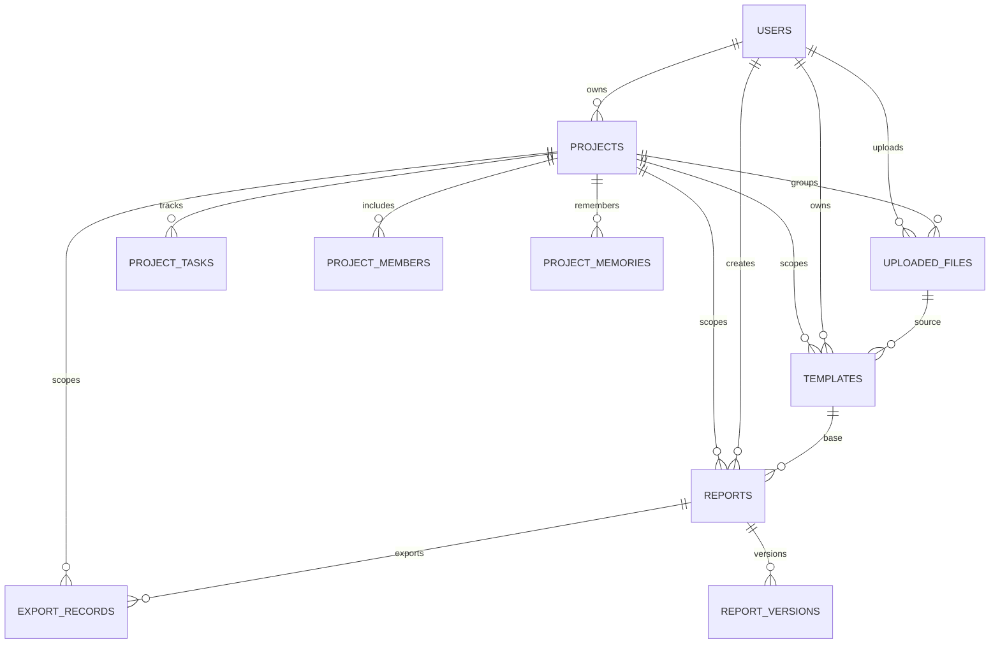

# 数据库设计

## 数据库技术栈

- 正式数据库：MySQL 8.4
- Python 驱动：PyMySQL
- ORM：SQLAlchemy 2
- 迁移工具：Alembic
- 测试数据库：SQLite 内存数据库
- 字符集：`utf8mb4`
- 排序规则：`utf8mb4_unicode_ci`

## 数据表

- `users`
- `projects`
- `project_tasks`
- `project_members`
- `project_memories`
- `uploaded_files`
- `templates`
- `reports`
- `report_versions`
- `export_records`

## 关系

- `users` 1:N `uploaded_files`
- `users` 1:N `projects`
- `projects` 1:N `project_tasks`
- `projects` 1:N `project_members`
- `projects` 1:N `project_memories`
- `projects` 1:N `uploaded_files`
- `projects` 1:N `templates`
- `projects` 1:N `reports`
- `projects` 1:N `export_records`
- `users` 1:N `templates`
- `users` 1:N `reports`
- `uploaded_files` 1:N `templates`
- `templates` 1:N `reports`
- `reports` 1:N `report_versions`
- `reports` 1:N `export_records`

`uploaded_files.project_id`、`templates.project_id`、`reports.project_id` 和
`export_records.project_id` 均允许为空，用于兼容旧数据和全局模板。删除项目时这些
业务表外键采用 `SET NULL`，项目任务、成员和记忆作为项目子数据采用 `CASCADE`。

## 项目表说明

`projects` 保存项目基础信息、项目阶段、技术栈、背景摘要和 `last_activity_at`。
`project_tasks` 保存项目级任务，状态建议使用 `pending`、`in_progress`、
`completed`、`blocked`。`project_members` 保存非系统账号成员和分工。
`project_memories` 预留项目长期记忆，支持 `goal`、`tech_stack`、
`current_stage`、`completed_work`、`current_problem`、`important_decision`、
`next_plan`、`background` 等类型。

## Mermaid ER 图

## 类型约定

- JSON 字段统一使用 SQLAlchemy 通用 `JSON` 类型，兼容 MySQL 与 SQLite。
- JSON 字段的 Python 默认值使用 `default=dict`，避免共享可变对象。
- 字符串字段均声明明确长度，适配 MySQL 索引长度限制。
- 时间字段使用 SQLAlchemy `func.now()` 或应用层 UTC 时间，避免数据库专用函数。
